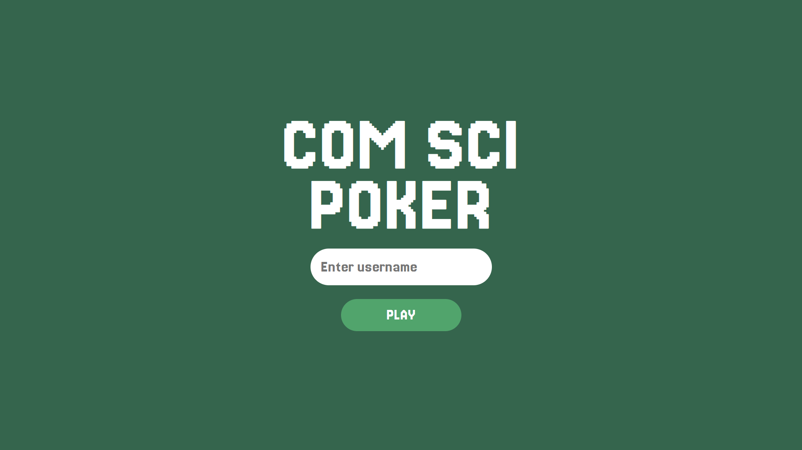

# 🃏 J-Poker: Online Java-based Texas Hold'em


**J-Poker** is a real-time multiplayer Texas Hold'em Poker web application. Built with a robust **Java Spring Boot** backend and a responsive **React** frontend, it features seamless real-time interactions via WebSockets, allowing players to join rooms, bet, and play against friends instantly without page refreshes.

---

## 📸 Screenshots

| Login & Lobby | In-Game Action | Winner Announcement |
|:---:|:---:|:---:|
|  |  |  |


---

## 🚀 Key Features

* **Real-time Gameplay:** Powered by **WebSockets** for instant state synchronization (cards, bets, chips).
* **Room Management:** Users can **Create** private rooms or **Join** via Room ID.
* **Complete Game Logic:** Implements Texas Hold'em rules (Check, Call, Raise, Fold, All-in, Side Pots).
* **Persistent User Data:** User accounts and chip balances are stored securely in **MongoDB**.
* **Scalable Architecture:** Dockerized backend running on Cloud Run (Serverless) and frontend on Firebase.

---

## 🛠 Tech Stack

### Frontend
* **React.js** (Vite/Create React App)
* **Axios:** For REST API calls (Login/User Info).
* **React-Use-WebSocket:** For managing stable WebSocket connections.
* **React Router:** For SPA navigation.

### Backend
* **Java 21** (JDK 21)
* **Spring Boot:** REST Controllers & WebSocket Message Broker.
* **Spring Data MongoDB:** NoSQL Database integration.
* **Docker:** Containerization.

### Infrastructure
* **Google Cloud Run:** Serverless Container Hosting (Backend).
* **Firebase Hosting:** Static Web Hosting (Frontend).
* **MongoDB Atlas:** Cloud Database.

---

## 🏗 Architecture

```mermaid
graph LR
    Client[User / React App] -- HTTPS/WSS --> CloudRun[Cloud Run (Spring Boot)]
    CloudRun -- Read/Write --> MongoDB[(MongoDB Atlas)]
    Client -- HTTPS --> Firebase[Firebase Hosting]
```

## 💻 Local Installation Guide

Follow these steps to run the project on your local machine (`localhost`).

### Prerequisites
* Java JDK 21
* Node.js (v18+)
* MongoDB (Installed locally or Cloud URI)

### 1. Backend Setup
1.  Navigate to the backend directory.
2.  Configure `src/main/resources/application.properties`:
    ```properties
    # Local MongoDB
    spring.data.mongodb.uri=mongodb://localhost:27017/jpokerdb
    server.port=8080
    ```
3.  Run the application:
    ```bash
    ./mvnw spring-boot:run
    ```

### 2. Frontend Setup
1.  Navigate to the frontend directory: `cd frontend`
2.  Install dependencies: `npm install`
3.  **Important:** Check `App.jsx` and `Login.jsx` to ensure URLs point to localhost.
    * **App.jsx:** `ws://localhost:8080/ws`
    * **Login.jsx:** `http://localhost:8080/api/...`
4.  Run the frontend:
    ```bash
    npm run dev
    ```

## ☁️ Cloud Deployment Guide

This project is deployed using **Google Cloud Platform (GCP)**.

### Step 1: Deploy Backend to Google Cloud Run

1.  **Build Docker Image:**
    ```bash
    # Make sure you are in the root directory containing Dockerfile
    gcloud builds submit --tag gcr.io/[YOUR_PROJECT_ID]/j-poker-img
    ```

2.  **Deploy Container:**
    ```bash
    gcloud run deploy j-poker-service \
      --image gcr.io/[YOUR_PROJECT_ID]/j-poker-img \
      --platform managed \
      --region asia-southeast1 \
      --allow-unauthenticated \
      --memory 1Gi \
      --set-env-vars MONGO_URI="mongodb+srv://<user>:<pass>@cluster.mongodb.net/..."
    ```
    *Note: Copy the `Service URL` generated (e.g., `https://j-poker-xyz.a.run.app`).*

### Step 2: Deploy Frontend to Firebase Hosting

1.  **Update API URLs:**
    In your React code (`App.jsx` & `Login.jsx`), replace `localhost:8080` with your Cloud Run URL.
    * Change `ws://` to **`wss://`** (Secure WebSocket).
    * Change `http://` to **`https://`**.

2.  **Build Production Files:**
    ```bash
    npm run build
    ```

3.  **Deploy:**
    ```bash
    firebase deploy
    ```